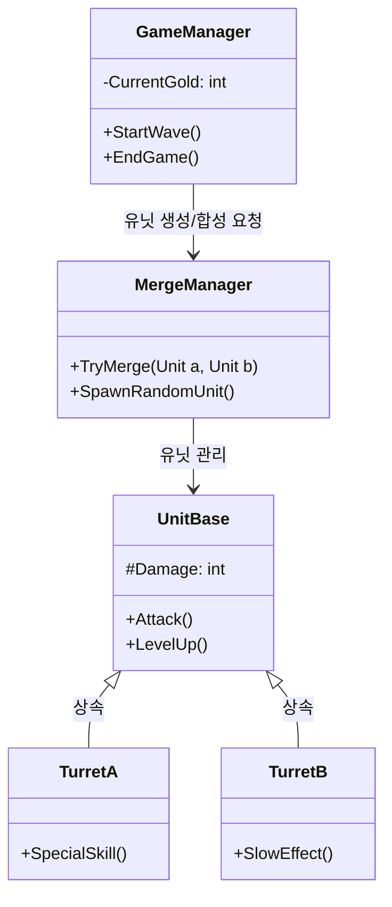

# [여기에 게임 이름을 쓰세요] 🛡️

유니티로 개발 중인 **안드로이드용 타워 디펜스 게임** 프로젝트입니다.
랜덤으로 유닛을 뽑고 합치는(Merge) 전략 게임입니다.

## 🎮 게임 특징
- **Merge 시스템**: 같은 타워 2개를 합치면 더 강한 타워가 됩니다.
- **Random 요소**: 어떤 타워가 나올지 모르는 운빨 디펜스!
- **웨이브 디펜스**: 몰려오는 적들을 막아내야 합니다.

## 🛠️ 개발 환경 (Tech Stack)
- **Engine**: Unity 6000.2.10f1
- **Language**: C#
- **IDE**: Visual Studio
- **Platform**: Android Mobile

## 📂 주요 코드 설명
이 게임의 핵심 로직은 다음과 같이 연결되어 있습니다.


---
```mermaid
classDiagram
    %% 클래스 정의
    class GameManager {
        +GameState State
        +GameStart()
        +GameOver()
    }
    class UIManager {
        +UpdateScoreUI()
        +ShowPausePopup()
    }
    class SoundManager {
        +PlayBGM()
        +PlaySFX()
    }
    class StageManager {
        +LoadLevel(int level)
    }

    %% 관계 연결 (화살표)
    GameManager --> UIManager : 점수/상태 전달
    GameManager --> SoundManager : 효과음 재생 요청
    GameManager --> StageManager : 레벨 로드 요청
